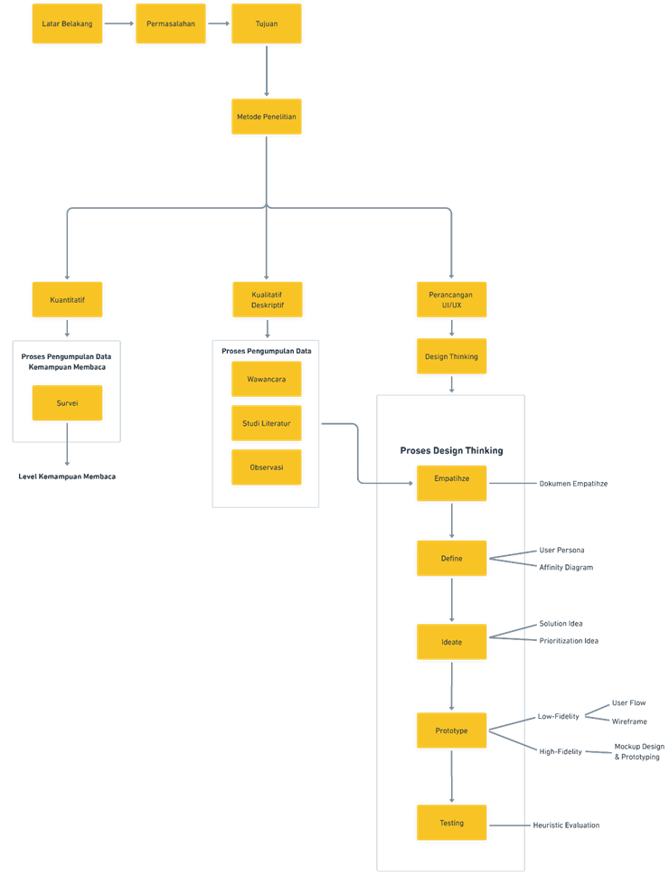

# 📚 Methods

## 🔍 Metode Penelitian

Penelitian ini dilakukan melalui tiga pendekatan utama sebagai berikut:

🔷 <strong> Pendekatan Kuantitatif</strong> — <em>Mengukur kemampuan membaca mahasiswa</em>

### Proses:

- 📊 **Survei** — Mengumpulkan data melalui kuesioner.
- 📈 **Analisis** — Menentukan level kemampuan membaca dari hasil survei.

🔷 <strong> Pendekatan Kualitatif Deskriptif</strong> — <em>Memahami kebutuhan pengguna secara mendalam</em>

### Proses:

- 🗣️ **Wawancara** — Mendalami kebutuhan pengguna.
- 📚 **Studi Literatur** — Referensi dari teori dan penelitian sebelumnya.
- 👁️ **Observasi** — Pengamatan langsung terhadap perilaku dan konteks pengguna.

> 💡 Data ini digunakan untuk mendukung tahapan design thinking.

🔷 <strong> Perancangan UI/UX</strong> — <em>Design Thinking Approach</em>

Pendekatan iteratif dan user-centered untuk menciptakan solusi desain yang relevan.

### 🔁 Tahapan:

1. **🧠 Empathize**

   - Observasi dan wawancara pengguna.
   - **Output**: Dokumen Empathize

2. **📌 Define**

   - Merumuskan problem statement dari hasil empati.
   - **Output**: User Persona, Affinity Diagram

3. **💡 Ideate**

   - Menghasilkan solusi kreatif.
   - **Output**: Evaluasi & Prioritisasi Ide

4. **🧪 Prototype**

   - Mendesain solusi dalam bentuk visual.
   - **Output**:
     - Low-Fidelity: User Flow, Wireframe
     - High-Fidelity: Mockup, Prototype Interaktif

5. **🧪 Testing**
   - Menguji efektivitas prototipe.
   - **Output**: Heuristic Evaluation, Feedback Pengguna

## 📊 Diagram Alur Penelitian

## 📚 Referensi Tambahan

- [Nielsen Norman Group – Design Thinking Process](https://www.nngroup.com/articles/design-thinking/)
- PISA Reading Literacy Framework
- Panduan Penelitian Deskriptif Kualitatif

## ✅ Ringkasan

| Pendekatan         | Tujuan                      | Metode Utama         | Output                            |
| ------------------ | --------------------------- | -------------------- | --------------------------------- |
| 🔢 Kuantitatif     | Mengukur kemampuan membaca  | Survei               | Level kemampuan Membaca Mahasiswa |
| 📋 Kualitatif      | Memahami kebutuhan pengguna | Wawancara, Observasi | Insight pengguna                  |
| 🎨 Design Thinking | Merancang solusi UI/UX      | 5 Tahapan Iteratif   | Prototipe & Feedback              |
